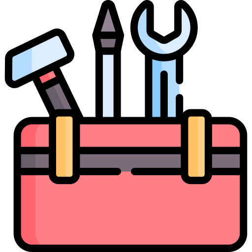
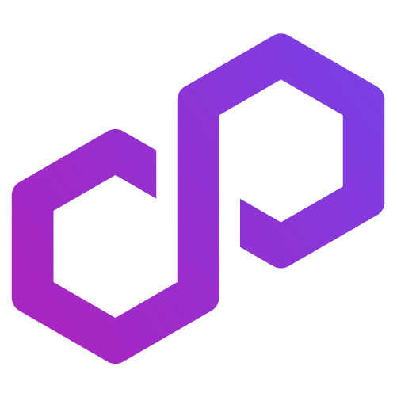
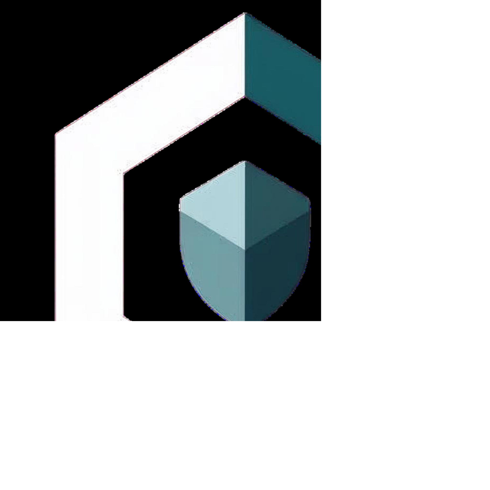

---
hide:
- navigation
- toc
---

	<header class="section">
		

			

				

					

						<h1 class="hero-heading">Auditium</h1>
						
Welcome .

						
 

					

					

						<!-- Animated Hero Background -->
						

							<canvas id="homepage-hero" class="animated-hero-canvas"></canvas>
							

						

					

				

			

		

	</header>
	<!-- <section class="section">
		

			

				

					

						

							

								<h3 class="heading-h3 margin-none">SOLUTIONS</h3>
							

							
Scalable Security Solutions for Every Stage of Your Web3 Lifecycle.

						

						<a href="https://docs.agglayer.dev" class="flex-card-item w-inline-block">
							

								
Agglayer

								
<svg xmlns="http://www.w3.org/2000/svg" display="block" width="100%" height="auto" viewbox="0 0 16 17" fill="none">
										<path d="M9.98805 5.70133L3.41071 12.2787L4.58922 13.4572L11.1666 6.87976V12.2013H12.8333V4.03467H4.66665V5.70133H9.98805Z" fill="currentColor"></path>
									</svg>

								
LIVE

							

							
Agglayer solves blockchain fragmentation by enabling sovereign chains to securely share liquidity, users, and state.

						</a>
						<a href="pos" class="flex-card-item w-inline-block">
							

								
Polygon PoS

								
<svg xmlns="http://www.w3.org/2000/svg" display="block" width="100%" height="auto" viewbox="0 0 16 17" fill="none">
										<path d="M9.98805 5.70133L3.41071 12.2787L4.58922 13.4572L11.1666 6.87976V12.2013H12.8333V4.03467H4.66665V5.70133H9.98805Z" fill="currentColor"></path>
									</svg>

								
LIVE

							

							
Deploy a dApp on the widely adopted Polygon Proof-of-Stake protocol, an EVM-compatible environment optimized for high throughput and low transaction fees.

						</a>
						<a href="zkEVM" class="flex-card-item w-inline-block">
							

								
Polygon zkEVM

								
<svg xmlns="http://www.w3.org/2000/svg" display="block" width="100%" height="auto" viewbox="0 0 16 17" fill="none">
										<path d="M9.98805 5.70133L3.41071 12.2787L4.58922 13.4572L11.1666 6.87976V12.2013H12.8333V4.03467H4.66665V5.70133H9.98805Z" fill="currentColor"></path>
									</svg>

								
LIVE

							

							
Deploy a dApp or build infrastructure on zkEVM, an EVM-equivalent ZK rollup designed for security.

						</a>
						<a href="https://docs.agglayer.dev/cdk/" class="flex-card-item w-inline-block">
							

								
Agglayer CDK

								
<svg xmlns="http://www.w3.org/2000/svg" display="block" width="100%" height="auto" viewbox="0 0 16 17" fill="none">
										<path d="M9.98805 5.70133L3.41071 12.2787L4.58922 13.4572L11.1666 6.87976V12.2013H12.8333V4.03467H4.66665V5.70133H9.98805Z" fill="currentColor"></path>
									</svg>

								
LIVE

							

							
Build and test a zero-knowledge Layer 2 blockchain on Ethereum. Learn about validium and rollup modes, custom native gas tokens, and more.

						</a>
					

					

						

							

								<h3 class="heading-h3 margin-none">RESOURCES</h3>
							

							
Technical Documentation & Resources for Web3 Security Researchers.

						

						<a href="https://docs.agglayer.dev" class="flex-card-item w-inline-block">
							

								
Agglayer

								
<svg xmlns="http://www.w3.org/2000/svg" display="block" width="100%" height="auto" viewbox="0 0 16 17" fill="none">
										<path d="M9.98805 5.70133L3.41071 12.2787L4.58922 13.4572L11.1666 6.87976V12.2013H12.8333V4.03467H4.66665V5.70133H9.98805Z" fill="currentColor"></path>
									</svg>

							

							
Introducing the multi-chain Agglayer: what it is and how it works.

						</a>
						<a href="innovation-design" class="flex-card-item w-inline-block">
							

								
Innovation & design

								
<svg xmlns="http://www.w3.org/2000/svg" display="block" width="100%" height="auto" viewbox="0 0 16 17" fill="none">
										<path d="M9.98805 5.70133L3.41071 12.2787L4.58922 13.4572L11.1666 6.87976V12.2013H12.8333V4.03467H4.66665V5.70133H9.98805Z" fill="currentColor"></path>
									</svg>

							

							
 Resources focused on both current and future Polygon technologies. It features detailed guides, foundational concepts, and previews of upcoming innovations. 

						</a>
						<a href="cdk/architecture/type-1-prover/intro-t1-prover" class="flex-card-item w-inline-block">
							

								
Type 1 prover

								
<svg xmlns="http://www.w3.org/2000/svg" display="block" width="100%" height="auto" viewbox="0 0 16 17" fill="none">
										<path d="M9.98805 5.70133L3.41071 12.2787L4.58922 13.4572L11.1666 6.87976V12.2013H12.8333V4.03467H4.66665V5.70133H9.98805Z" fill="currentColor"></path>
									</svg>

							

							
The Polygon type 1 proving component used for creating proofs on your ZK-EVM chain.

						</a>
						<a href="./innovation-design/plonky" class="flex-card-item w-inline-block">
							

								
Plonky 2 & 3

								
<svg xmlns="http://www.w3.org/2000/svg" display="block" width="100%" height="auto" viewbox="0 0 16 17" fill="none">
										<path d="M9.98805 5.70133L3.41071 12.2787L4.58922 13.4572L11.1666 6.87976V12.2013H12.8333V4.03467H4.66665V5.70133H9.98805Z" fill="currentColor"></path>
									</svg>

							

							
Keep up with our latest cryptographic developments with the Plonky 2 & 3 libraries.

						</a>
						<a href="innovation-design/polygon-protocols" class="flex-card-item last-item  w-inline-block">
							

								
Polygon protocols

								
<svg xmlns="http://www.w3.org/2000/svg" display="block" width="100%" height="auto" viewbox="0 0 16 17" fill="none">
										<path d="M9.98805 5.70133L3.41071 12.2787L4.58922 13.4572L11.1666 6.87976V12.2013H12.8333V4.03467H4.66665V5.70133H9.98805Z" fill="currentColor"></path>
									</svg>

							

							
The Polygon protocol that’s best for you. A guide and decision matrix designed to empower users to navigate the evolving world of decentralization.

						</a>
					

				

			

		

	</section> -->
	<!-- <section class="section">
		

			

				

					

						<h2 class="heading-h2">Auditium by the Numbers</h2>
					

					

						

							
50+

							
High/Crits Found

						

						

							
20+

							
Audits

						

						

							
$1B+

							
TVL Secured

						

					

				

			

		

	</section> -->
	<!-- Trusted Clients Section -->
	<!-- <section class="section">
		

			

				

					

						<h2 class="heading-h2">Trusted By</h2>
					

					

						

							

								
							

							

								
							

							

								
							

							

								
							

							

								
							

							

								
							

							

								
							

							

								
							

							

								
							

							

								
							

							

								
							

							

								
							

							

								
							

							

								
							

							

								
							

							

								
							

							

								
							

							

								
							

						

					

				

			

		

	</section>
	<section class="section">
		

			

				

					

						<h2 class="heading-h2">Developer resources</h2>
						
For developers who know what they want to build and are ready to go.

					

					

						<a href="/tools/" class="home-feature-card w-inline-block">
							

								

									
Developer tools

									
<svg xmlns="http://www.w3.org/2000/svg" display="block" width="100%" height="auto" viewbox="0 0 16 17" fill="none">
											<path d="M9.98805 5.70133L3.41071 12.2787L4.58922 13.4572L11.1666 6.87976V12.2013H12.8333V4.03467H4.66665V5.70133H9.98805Z" fill="currentColor"></path>
										</svg>

								

								
RPC providers, faucets, data indexing, Web3 dApp development SDKs, block explorers, storage, and more.

							

						</a>
						<a href="./zkEVM/how-to/write-contract" class="home-feature-card w-inline-block">
							

								

									
Write a zkEVM contract

									
<svg xmlns="http://www.w3.org/2000/svg" display="block" width="100%" height="auto" viewbox="0 0 16 17" fill="none">
											<path d="M9.98805 5.70133L3.41071 12.2787L4.58922 13.4572L11.1666 6.87976V12.2013H12.8333V4.03467H4.66665V5.70133H9.98805Z" fill="currentColor"></path>
										</svg>

								

								
Step-by-step guidance for writing smart contracts with zkEVM.

							

						</a>
						<a href="https://ecosystem.polygon.technology/spn/explore/?search=&competency=&chain=" class="home-feature-card w-inline-block">
							

								

									
Solution Provider Network

									
<svg xmlns="http://www.w3.org/2000/svg" display="block" width="100%" height="auto" viewbox="0 0 16 17" fill="none">
											<path d="M9.98805 5.70133L3.41071 12.2787L4.58922 13.4572L11.1666 6.87976V12.2013H12.8333V4.03467H4.66665V5.70133H9.98805Z" fill="currentColor"></path>
										</svg>

								

								
Searchable catalog of tooling and infrastructure for developers.

							

						</a>
					

				

			

		

	</section>
	<section class="section">
		

			

				

					

						<h2 class="heading-h2">Quickstart</h2>
						
Are you ready to start building?

					

					

						<a href="https://docs.agglayer.dev/cdk/cdk-opgeth/local-guide/" class="home-feature-card w-inline-block">
							

								
Agglayer CDK: Deploy a local test rollup

								
<svg xmlns="http://www.w3.org/2000/svg" display="block" width="100%" height="auto" viewbox="0 0 16 17" fill="none">
										<path d="M9.98805 5.70133L3.41071 12.2787L4.58922 13.4572L11.1666 6.87976V12.2013H12.8333V4.03467H4.66665V5.70133H9.98805Z" fill="currentColor"></path>
									</svg>

							

						</a>
						<a href="zkEVM/how-to/using-hardhat/" class="home-feature-card w-inline-block">
							

								

									
Polygon zkEVM: Deploy a smart contract to the zkEVM Cardona testnet

									
<svg xmlns="http://www.w3.org/2000/svg" display="block" width="100%" height="auto" viewbox="0 0 16 17" fill="none">
											<path d="M9.98805 5.70133L3.41071 12.2787L4.58922 13.4572L11.1666 6.87976V12.2013H12.8333V4.03467H4.66665V5.70133H9.98805Z" fill="currentColor"></path>
										</svg>

								

							

						</a>
						<a href="pos/get-started/building-on-polygon/" class="home-feature-card w-inline-block">
							

								
Polygon PoS: Build a new web3 dApp

								
<svg xmlns="http://www.w3.org/2000/svg" display="block" width="100%" height="auto" viewbox="0 0 16 17" fill="none">
										<path d="M9.98805 5.70133L3.41071 12.2787L4.58922 13.4572L11.1666 6.87976V12.2013H12.8333V4.03467H4.66665V5.70133H9.98805Z" fill="currentColor"></path>
									</svg>

							

						</a>
					

					

						<a href="/pos/how-to/bridging/ethereum-polygon/portal-ui/" class="home-feature-card w-inline-block">
							

								
Polygon PoS: Bridge tokens and send interlayer messages

								
<svg xmlns="http://www.w3.org/2000/svg" display="block" width="100%" height="auto" viewbox="0 0 16 17" fill="none">
										<path d="M9.98805 5.70133L3.41071 12.2787L4.58922 13.4572L11.1666 6.87976V12.2013H12.8333V4.03467H4.66665V5.70133H9.98805Z" fill="currentColor"></path>
									</svg>

							

						</a>
						<a href="zkEVM/get-started/setup-nodes/production-node/" class="home-feature-card w-inline-block">
							

								
Polygon zkEVM: Set up a zkNode

								
<svg xmlns="http://www.w3.org/2000/svg" display="block" width="100%" height="auto" viewbox="0 0 16 17" fill="none">
										<path d="M9.98805 5.70133L3.41071 12.2787L4.58922 13.4572L11.1666 6.87976V12.2013H12.8333V4.03467H4.66665V5.70133H9.98805Z" fill="currentColor"></path>
									</svg>

							

						</a>
					

				

			

		

	</section> -->

